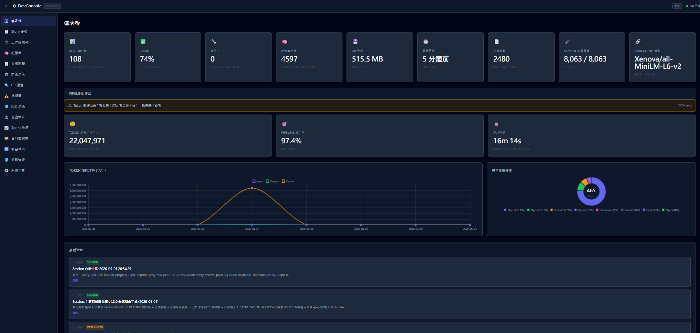
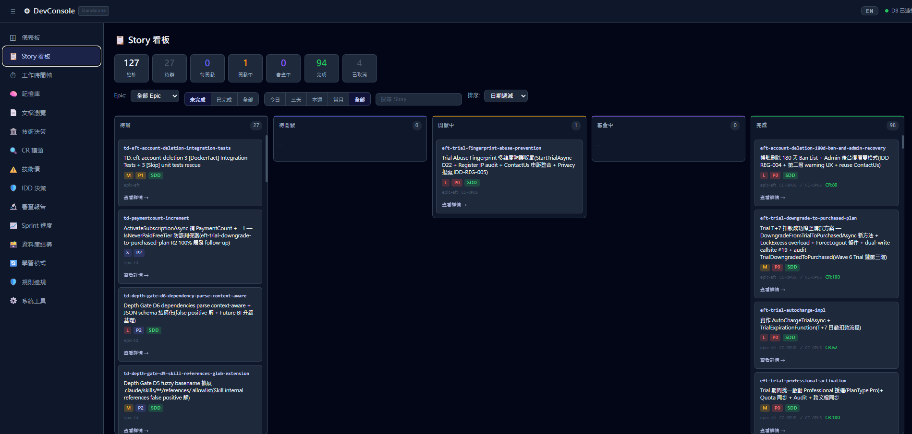
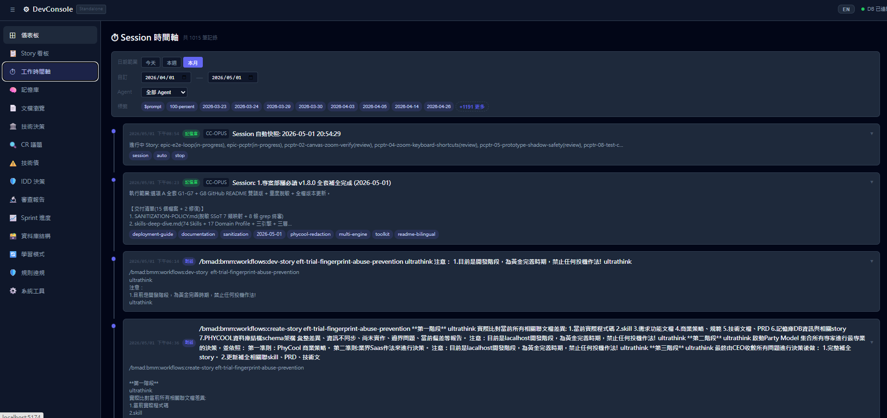
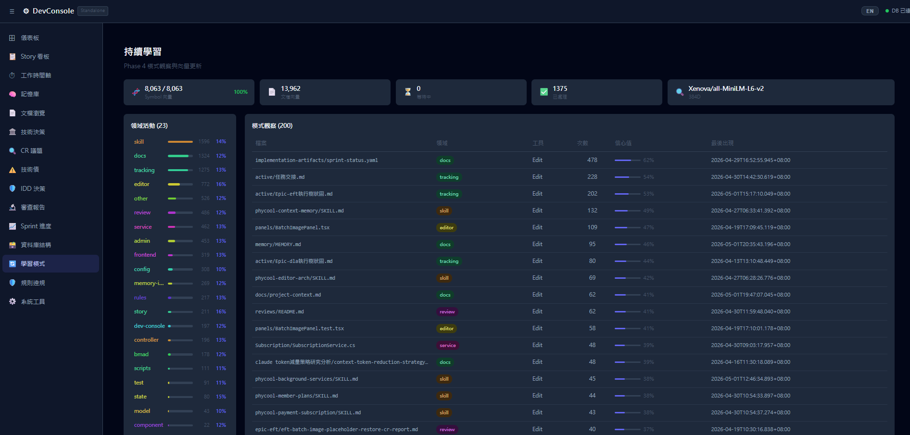
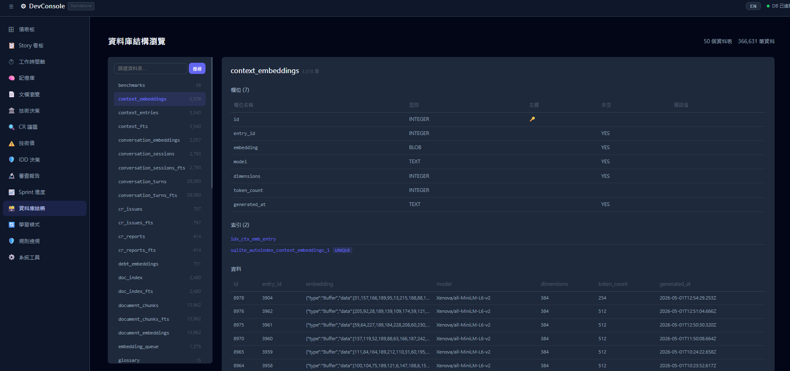
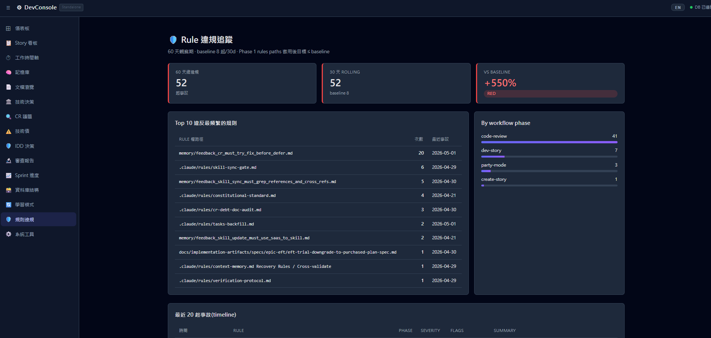

# Claude Agent Toolkit (v1.8.0)

> **Multi-Engine AI Agent Collaboration Toolkit** — Battle-tested deployment templates, Token reduction strategy, Context Memory DB, and BMAD-driven workflow integration for Claude Code / Gemini CLI / Antigravity IDE / Rovo Dev CLI.

**Last Updated**: 2026-05-01
**Languages**: [English](README.md) | [繁體中文](README.zh-TW.md)

---

## Primary Development Strategy

This toolkit is the **deployable distillation** of a real-world multi-engine AI Agent project's accumulated optimization wisdom (2026-01 → 2026-05). Battle-tested across **41 TRS Stories**, validated by **6 Epics (BU/CMI/CCI/ECC/WFQ/Phase4)**, and crystallized into one-command deployment.

### What's New in v1.8.0 (2026-05-01)

- **Skills system matured**: 74 skills across 17 Domain Profiles + three-engine sync (`.claude/`/`.gemini/`/`.agent/`)
- **Hooks expanded**: 14 hooks (was 6) including 11-layer RAG injection
- **Rules consolidated**: 20 rules with 5 SUPREME Mandates + 9 Lifecycle Invariants + 3-Tier Subagent Boundary
- **IDD Framework**: 4-layer annotation (Code/ADR/DB/Memory) with 4 sub-types (COM/STR/REG/USR)
- **Memory DB scaled**: 30+ tables / 23 MCP tools / 82 scripts / DevConsole Web UI
- **BMAD workflows evolved**: v6.0.0-alpha.21 + Epic BU upgrade to v6.2.2 concept (XML→Markdown step files)
- **Pipeline 6-Layer Defense**: L5 Heartbeat + L6 429/Model Purity detection
- **OTel Token tracking**: `otel-micro-collector.js` + `workflow_executions` table 4 token columns + cost USD
- **Phase 4 Rule Violation Tracker**: 5-Layer Anti-Recidivism Chain
- **9 deep-dive documents added**: SANITIZATION-POLICY / skills / rules / idd / hooks / memory / mcp / bmad-workflows / commands

---

## What Is This?

A **complete, portable multi-engine collaboration template package** combining:
- Token economics (static cost cut from ~18K → ~13K, peak −76.5%)
- Context Memory DB (SQLite + FTS5 + ONNX local embedding, zero API cost)
- 14 Hooks lifecycle automation (RAG / Pipeline / Debt / IDD / Rule Violation)
- 74 Skills with auto-detection + three-engine synchronization
- 20 Rules including Constitutional / Verification / Sync Gates / IDD Protection
- BMAD workflow overlay (create-story / dev-story / code-review with 41 step files)
- DevConsole Web UI for memory visualization

---

## Framework Integration: BMAD Method × Everything Claude Code

| Framework | Strength | Integration |
|:----|:----|:----|
| **BMAD Method** v6.0.0-alpha.21 | Spec-driven agile team simulation, 17 agents, 4-phase workflows | `_bmad/` directory, Markdown step file format (Epic BU) |
| **Everything Claude Code** v1.9.0 | Token economics, TDD workflow, AgentShield, continuous learning | Hooks integration, RAG injection, Skills marketplace |
| **Custom Augmentation** | DB-First stories, Sync Gates, Pipeline 6-layer defense, IDD | This toolkit's overlay |

**Integration Strategy**: Take both frameworks' strengths, fuse via overlay pattern, deploy via PowerShell automation.

---

## Table of Contents

1. [Problems Solved](#problems-solved)
2. [Architecture Overview](#architecture-overview)
3. [Directory Structure](#directory-structure)
4. [Quick Start](#quick-start)
5. [Module Details](#module-details)
6. [Research Reports Index](#research-reports-index)
7. [TRS Execution Stories](#trs-execution-stories)
8. [Requirements](#requirements)
9. [Deployment Scenarios](#deployment-scenarios)
10. [Version History](#version-history)
11. [License & Acknowledgments](#license--acknowledgments)

---

## Problems Solved

| Challenge | Symptom | Solution |
|:----|:----|:----|
| Static prompt overhead too large | Each new conversation loads ~18K tokens before user types | Three-layer CLAUDE.md (global ≤30 lines / project ≤200 / local) → ~13K (−28%) |
| Cross-conversation knowledge lost | AI re-learns same bug fixes / decisions per session | Context Memory DB + 11-layer RAG injection via UserPromptSubmit hook |
| Multi-engine coordination chaos | Claude / Gemini / Antigravity / Rovo Dev work in silos | Unified `AGENTS.md` charter + sprint-status.yaml + tracking files state machine |
| Pipeline silent stalling | Sub-windows hang on quota exhaustion / model degradation | 6-Layer defense: Heartbeat (L5) + 429/Model Purity (L6) auto-kill |
| Skills drift over time | Code changes but Skills not synced → next session uses stale SOP | Skill-Sync-Gate + Skill-IDD-Sync-Gate + literal Skill tool invocation mandatory |
| Tech debt invisibility | Defer reasons forgotten, repeat discussions | Tech Debt v3.0 framework (6 categories × 5 severity × Priority Score × 5-Min Rule × Boy Scout × 5-Layer Triage) |
| Intentional decisions confused with debt | Free-plan-no-gate logged as "TODO fix later" | IDD Framework: 4-layer annotation, 4 sub-types, forbidden_changes protection |

---

## Architecture Overview

### Token Consumption Layered Model

```
Layer 0: System Prompt (immutable)
Layer 1: ~/.claude/CLAUDE.md      (global, ≤30 lines, ~221 tokens)  ← Always-On
Layer 2: ./CLAUDE.md              (project, ≤200 lines, ~1,276 tokens) ← Always-On
Layer 3: ./CLAUDE.local.md        (local, identity, ~241 tokens)  ← Always-On
Layer 4: .claude/rules/*.md       (20 rules, ~5,400 tokens)  ← Always-On
Layer 5: .claude/skills/*/SKILL.md descriptions (74 skills, ~6,200 tokens)  ← Always-On (descriptions)
Layer 6: Workflow execution       (per-task, on-demand, ~1,500-3,000 tokens)
```

### Context Memory DB 4-Layer Architecture

```
L0 Knowledge Layer (essential)
  ├── 30+ tables: context_entries / tech_entries / tech_debt_items /
  │   intentional_decisions / stories / cr_reports / cr_issues /
  │   conversation_sessions / conversation_turns / doc_index /
  │   document_chunks / glossary / workflow_executions / benchmarks /
  │   test_journeys / test_traceability / pipeline_checkpoints /
  │   sprint_index / rule_violations / 7 embedding tables
  ├── FTS5 trigram + WAL mode + ledger.jsonl (disaster recovery)
  └── 23 MCP tools (search × 10 / write × 4 / trace × 3 / analytics × 6)

L1 Code Semantic Layer (optional, .NET SDK required)
  └── symbol_index / symbol_dependencies / symbol_embeddings (Roslyn AST)

L2 Vector Semantic Layer (optional, local ONNX or OpenAI)
  └── Xenova/all-MiniLM-L6-v2 (384D, zero API cost)

L3 Dynamic Injection Layer
  └── UserPromptSubmit Hook → 11-layer RAG injection
      (Session / Rule Violations / Story / Tech Debt / Decisions /
       Pipeline / Skills / LSP / Code RAG / IDD / Document RAG)

Phase 4 Continuous Learning
  └── retrieval_observations / retrieval_hits / retrieval_keywords /
      pattern_observations / embedding_queue
```

### Multi-Engine Collaboration Architecture

```
┌─────────────┬─────────────┬─────────────┬─────────────┐
│ Claude Code │ Gemini CLI  │ Antigravity │ Rovo Dev    │
│ (CC-OPUS)   │ (GC-PRO)    │ (AG-OPUS)   │ (RD-SONNET) │
├─────────────┼─────────────┼─────────────┼─────────────┤
│ .claude/    │ .gemini/    │ .agent/     │ .rovodev/   │
│ 74 skills   │ 75 skills   │ 74 skills   │ -           │
└─────────────┴─────────────┴─────────────┴─────────────┘
        ↓ shared state via ↓
┌──────────────────────────────────────────────────────┐
│ AGENTS.md (unified charter)                          │
│ sprint-status.yaml (state machine)                    │
│ docs/tracking/active/*.track.md (per-story log)      │
│ context-memory.db (Context Memory DB SSoT)            │
└──────────────────────────────────────────────────────┘
```

---

## Directory Structure

```
claude-agent-toolkit/
├── deployment/
│   ├── config-templates/
│   │   ├── claude/                  ← Project-level Claude config
│   │   │   ├── CLAUDE.md.template
│   │   │   ├── CLAUDE.local.md.template
│   │   │   ├── MEMORY.md.template
│   │   │   ├── settings.json.template
│   │   │   ├── settings.local.json.template
│   │   │   ├── hooks/
│   │   │   │   ├── pre-prompt-rag.js          ← 11-layer RAG injection
│   │   │   │   ├── session-recovery.js
│   │   │   │   ├── precompact-tool-preprune.js
│   │   │   │   └── ... (14 hooks total)
│   │   │   └── rules/                          ← 20 rules
│   │   │       ├── constitutional-standard.md
│   │   │       ├── verification-protocol.md
│   │   │       ├── skill-sync-gate.md
│   │   │       ├── skill-idd-sync-gate.md
│   │   │       ├── skill-tool-invocation-mandatory.md
│   │   │       ├── deployment-doc-freshness.md
│   │   │       ├── story-lifecycle-invariants.md
│   │   │       └── ... (12 more)
│   │   ├── claude-global/                      ← ~/.claude global layer
│   │   │   ├── CLAUDE.md.template (27 lines minimal)
│   │   │   ├── settings.json.template
│   │   │   └── commands/                       ← 3 Telegram bridge
│   │   ├── context-db/                         ← MCP server template
│   │   │   ├── server.js
│   │   │   ├── package.json.template
│   │   │   ├── mcp.json.template
│   │   │   └── scripts/init-db.js
│   │   ├── gemini/                             ← .gemini/ template
│   │   ├── antigravity/                        ← .agent/ template
│   │   └── rovodev/                            ← .rovodev/ template
│   ├── bmad-overlay/                           ← BMAD v6.2.2 concept
│   │   └── 4-implementation/
│   │       ├── code-review/   (13 step files + saas-standards.md)
│   │       ├── create-story/  (8 step files)
│   │       └── dev-story/     (13 step files)
│   ├── scripts/                                ← Automation
│   │   ├── deploy-context-db.ps1
│   │   ├── story-pipeline.ps1
│   │   ├── batch-runner.ps1
│   │   ├── batch-audit.ps1
│   │   ├── epic-auto-pilot.ps1
│   │   ├── otel-micro-collector.js             ← Token tracking
│   │   ├── pipeline-recovery.js
│   │   ├── pipeline-quota-check.js
│   │   ├── pipeline-log-tokens.js
│   │   ├── verify-deployment-docs.cjs          ← Doc freshness CI
│   │   └── ... (10+ check-*.ps1/.cjs scripts)
│   └── docs/
│       ├── README.md
│       ├── 開發前環境部署_v3.0.0.md             ← Main deployment manual
│       ├── BMAD架構演進與優化策略.md
│       ├── context-memory-db-strategy.md
│       ├── multi-agent-parallel-execution-strategy.md
│       ├── worktree-quick-reference.md
│       ├── SANITIZATION-POLICY.md              ← (NEW v1.8.0)
│       ├── skills-deep-dive.md                 ← (NEW v1.8.0)
│       ├── rules-deep-dive.md                  ← (NEW v1.8.0)
│       ├── idd-framework.md                    ← (NEW v1.8.0)
│       ├── hooks-events-deep-dive.md           ← (NEW v1.8.0)
│       ├── memory-system-deep-dive.md          ← (NEW v1.8.0)
│       ├── mcp-ecosystem.md                    ← (NEW v1.8.0)
│       ├── bmad-workflows-evolution.md         ← (NEW v1.8.0)
│       ├── commands-reference.md               ← (NEW v1.8.0)
│       └── global-claude-config.md             ← (NEW v1.8.0)
├── tools/
│   └── dev-console/                            ← React + Express Web UI
└── research/                                   ← Strategy reports
    ├── token-reduction-final-report.md
    ├── multi-engine-collaboration-strategy.md
    ├── bmad-vs-everything-claude-code.md
    └── 當前環境完整快照_2026-05-01.md          ← (NEW v1.8.0 SSoT snapshot)
```

---

## Quick Start

### Prerequisites

```bash
node --version    # ≥18 (MCP Server runtime)
git --version     # ≥2.30
claude --version  # Claude Code CLI (required)
gemini --version  # Optional
```

### 5-Step Deployment

```powershell
# Step 1: Deploy Context Memory DB (one-shot)
cd <your-project-root>
powershell -ExecutionPolicy Bypass `
  -File <toolkit-path>/deployment/scripts/deploy-context-db.ps1

# Step 2: Configure CLAUDE.md (project layer)
cp <toolkit-path>/deployment/config-templates/claude/CLAUDE.md.template ./CLAUDE.md
# Edit: project name, Skill index, test accounts, forbidden patterns

# Step 3: Deploy Rules (19 files)
mkdir -p .claude/rules
cp <toolkit-path>/deployment/config-templates/claude/rules/*.md .claude/rules/

# Step 4: (Optional) BMAD Overlay
cp -r <toolkit-path>/deployment/bmad-overlay/4-implementation/* `
       _bmad/bmm/workflows/4-implementation/

# Step 5: Verify
claude mcp list                                     # MCP server registered
node <toolkit>/deployment/scripts/verify-deployment-docs.cjs   # Doc freshness
```

### DevConsole Web UI (Optional Visualization)

```bash
cd tools/dev-console
npm install
npm run dev
# Frontend: http://localhost:5174
# API:      http://localhost:3001
```

#### DevConsole Screenshots

| Page | Preview |
|:----|:----|
| **Dashboard** — Story status KPI + recent activity |  |
| **Stories Kanban** — Epic filter + Markdown rendering |  |
| **Sessions Timeline** — Conversation lifecycle records |  |
| **Patterns / Continuous Learning** — Phase 4 retrieval observations & hot entries |  |
| **Memory Schema** — 30+ tables visualized |  |
| **Rule Violations** — Phase 3 hint hook tracker(top-5 hot zones / 30 days) |  |

> All screenshots captured from real-world deployment(SaaS app development workspace, 2026-05-01).
> Web UI source: `tools/dev-console/` (React 18 + Express)

---

## Module Details

### 1. Token Economics

- **Achievement**: Static prompt overhead reduced from ~18K → ~13K (−28%; peak −76.5% for stripped projects)
- **Strategy**: Three-layer CLAUDE.md (global / project / local) + Skills lazy load + Rules conditional paths
- **Reference**: `research/token-reduction-final-report.md`

### 2. Context Memory DB

- **Engine**: SQLite + FTS5 trigram + WAL mode
- **Embedding**: Xenova/all-MiniLM-L6-v2 (384D, zero API)
- **Tables**: 30+ (knowledge / code / vector / Phase 4 learning / Phase 5 metrics)
- **MCP Tools**: 23 (search × 10 / write × 4 / trace × 3 / analytics × 6)
- **Reference**: `deployment/docs/memory-system-deep-dive.md`

### 3. Multi-Engine Collaboration

- **Engines**: Claude Code (CC) / Gemini CLI (GC) / Antigravity IDE (AG) / Rovo Dev (RD)
- **Charter**: Unified `AGENTS.md` v3.0 (857 lines)
- **State**: `sprint-status.yaml` + `tracking/active/*.track.md`
- **MCP Sharing**: stdio identical / HTTP transport key differs (`url` vs `httpUrl` vs `serverUrl`)
- **Reference**: `research/multi-engine-collaboration-strategy.md`

### 4. Pipeline Automation (Epic WFQ)

- **3-Slot Concurrency**: create / dev / review parallel, 12s interval, 8min watchdog
- **6-Layer Defense**:
  - L1 Pre-batch token check
  - L2 Pre-story token check
  - L3 Phase Gate
  - L4 Post-execution audit
  - L5 Heartbeat (Stop hook timestamp)
  - L6 429/Model Purity (stderr scan, kill on degrade)
- **Model Purity Rule**: NO Opus→Sonnet auto-degrade (corrupts code-review)
- **OTel Token Tracking**: `otel-micro-collector.js` (port 49152-65535) → JSONL → DB
- **Reference**: `deployment/docs/Claude智能中控自動化排程/pipeline-audit-token-safety.md`

### 5. BMAD Workflow Overlay

- **Base**: BMAD Method v6.0.0-alpha.21
- **Concept Upgrade**: v6.2.2 (Markdown step file format, XML deprecated)
- **3 Core Workflows**:
  - `code-review`: 13 steps + 3-layer parallel (Blind / Edge / Acceptance) + SaaS 9 dimensions + Phase A-D Audit
  - `create-story`: 8 steps + 7 Depth Gates (D1-D7) + DB-first + ATDD
  - `dev-story`: 13 steps + Skill Staleness + Migration Cascade + KB Error Query + 3-layer Sync Gates
- **Reference**: `deployment/docs/bmad-workflows-evolution.md`

### 6. Skills Governance

- **Total**: 74 (47 domain + 1 third-party + 26 utility)
- **Domain Profile**: 17 domains, ≤3 members → all load; ≥4 → primary + 2 most relevant
- **Three-Engine Sync**: `.claude/` ⟷ `.gemini/` ⟷ `.agent/` (md5 identical except engine-specific frontmatter)
- **Sync Gates 3 Layers**: skill-sync-gate / skill-idd-sync-gate / skill-tool-invocation-mandatory
- **Reference**: `deployment/docs/skills-deep-dive.md`

### 7. IDD Framework (Intentional Decision Debt)

- **4 Sub-types**: COM (Commercial) / STR (Strategic) / REG (Regulatory) / USR (User Feedback)
- **4-Layer Annotation**: Code (`[Intentional: IDD-XXX]`) / ADR / DB (`intentional_decisions` table) / Memory (`memory/intentional_*.md` + MEMORY.md)
- **Forbidden Changes**: JSON pattern protected by Skill-IDD-Sync-Gate
- **Reference**: `deployment/docs/idd-framework.md`

---

## Research Reports Index

| Report | Path |
|:----|:----|
| Token Reduction Final Report v2.0 | `research/Claude_Code_Token_減量策略_最終彙整報告_v2.0.md` |
| Multi-Engine Collaboration Strategy | `research/multi-engine-collaboration-strategy.md` |
| BMAD-METHOD vs Everything Claude Code | `research/BMAD-METHOD 與 everything-claude-code 比較.md` |
| Hermes Adoption (5 concept ports) | `research/hermes導入.md` |
| Project Optimization Plan F1-F5 / G1-G3 / H1-H4 | `research/專案優化項目計畫.md` |
| **Current Environment Snapshot 2026-05-01** | `research/當前環境完整快照_2026-05-01.md` ← (NEW v1.8.0) |

---

## TRS Execution Stories (41 battle-tested)

| Epic | Stories | Outcome |
|:----|:----:|:----|
| TRS-0~34 | 35 | Token static cost −86% (15.4K→2.6K) |
| TD-15~19 | 5 | DB Schema cleanup + Skill validator |
| TD-32~36 | 5 | Context Memory DB + MCP Server + ONNX |
| CMI-1~6 | 6 | Conversation lifecycle + ETL + dialogue memory |
| WFQ-01~08 | 8 | Pipeline quota + Heartbeat + 429/Model Purity |
| ECC-01~05 | 5 | Hook infrastructure (Pre-Commit / Config Protection / RAG / suggest-compact / MCP Health) |
| BU-01~06 | 6 | BMAD v6.2.2 upgrade (XML→MD + 3-layer parallel + Skill Validator) |

---

## Requirements

| Component | Version | Required | Purpose |
|:----|:----:|:----:|:----|
| Node.js | ≥18 | ✅ | MCP Server runtime |
| PowerShell | 5.1+ | ✅ | Automation scripts (Windows) |
| Claude Code CLI | latest | ✅ | Primary AI engine |
| Git | ≥2.30 | Recommended | Version control |
| .NET SDK | ≥8 | Optional | L1 Code RAG (Roslyn) |
| Gemini CLI | latest | Optional | Multi-engine support |
| Antigravity IDE | latest | Optional | E2E testing + IDE integration |
| Rovo Dev CLI | latest | Optional | Atlassian integration |

---

## Deployment Scenarios

| Scenario | Engines | Use Case |
|:----|:----|:----|
| **Minimal** | Claude Code only | Solo dev, VS Code workflow |
| **Dual** | Claude + Gemini | Plan-vs-execute split |
| **Triple** | Claude + Gemini + Antigravity | + E2E testing, IDE integration |
| **Full** | All 4 engines | + Atlassian Jira/Confluence integration |

---

## Version History

| Version | Date | Changes |
|:----|:----|:----|
| **1.8.0** | **2026-05-01** | **9 deep-dive documents added** (SANITIZATION-POLICY / skills / rules / idd / hooks / memory / mcp / bmad-workflows / commands) + **global-claude-config.md** + **当前環境完整快照 2026-05-01** snapshot. Numbers updated: 14 hooks (was 6) / 74 skills (was 38) / 20 rules (was 7) / 30+ DB tables / 23 MCP tools / 82 scripts. **Maintenance rule**: `deployment-doc-freshness.md` + `verify-deployment-docs.cjs` CI advisory. **3-Layer Sync Gates** mandatory enforcement. **IDD 4-layer annotation** + 4 sub-types. **Pipeline 6-Layer Defense** (L5 Heartbeat + L6 429/Model Purity + Model Purity Rule). **OTel Token tracking**. **BMAD v6.2.2 concept upgrade** (Epic BU). **Phase 4 Rule Violation Tracker** (5-Layer Anti-Recidivism Chain). |
| 1.7.1 | 2026-04-04 | Epic WFQ Pipeline quota management + Heartbeat (L5) + 429/Model Purity (L6) + Recovery Script + OTel Token + Quota Prediction + Phase Timeout tiering + ModelPricing + Model Purity Rule. -p mode Truth Table (v2.1.92). DB Schema +4 columns. BMAD Workflow definition reinforcement (4 GAP fixes). 6 Stories, avg CR 93.5. |
| 1.7.0 | 2026-03-12 | G-class SDD+ATDD+TDD methodology (FLOW-OPT-001) + Epic CMI conversation lifecycle (CMI-1~6) + bmad-overlay sync 5 files + sdd-spec-generator skill. Token reduction Session cost ~4,910 tokens (−68%). |
| 1.6.0 | 2026-03-07 | Context Memory DB strategy (TD-32~36) + MCP Server + init-db + deploy-context-db.ps1 + context-memory-db.md rule + MEMORY.md template (~350 tokens) + TD-15~19 schema cleanup. |
| 1.5.0 | 2026-03-02 | Pipeline central control automation + Token safety valve + batch-audit + TRS-35/37/38 (Sprint Status compression / Registry archival / single-read). |
| 1.4.0 | 2026-02-28 | Tech Debt central registry (TRS-34) + worktree merge rules. |
| 1.3.0 | 2026-02-27 | Worktree quick reference + main manual v3.1.0 (PART 8.5 Worktree parallel + merge SOP). |
| 1.2.0 | 2026-02-27 | BMAD architecture evolution analysis + Token quantification + ECC coverage + migration decision framework. |
| 1.1.0 | 2026-02-27 | Rovo Dev CLI templates + CLI installation guides + conditional deployment + environment matrix + new engine onboarding SOP. |
| 1.0.0 | 2026-02-27 | Initial: TRS optimization overlay + config templates + automation scripts. |

---

## License & Acknowledgments

**License**: MIT

**Source Materials**:
- [BMAD-METHOD](https://github.com/bmadcode/BMAD-METHOD) — MIT License
- [Everything Claude Code](https://github.com/anthropics/everything-claude-code) — Anthropic course materials
- Custom integration & augmentation by toolkit author

**Acknowledgments**:
- Anthropic team for Claude Code CLI + MCP protocol
- BMAD Method community for spec-driven workflow methodology
- All TRS Story contributors for battle-testing optimizations

---

> **Languages**: [English](README.md) | [繁體中文](README.zh-TW.md)
> **Version**: 1.8.0 | **Last Updated**: 2026-05-01
