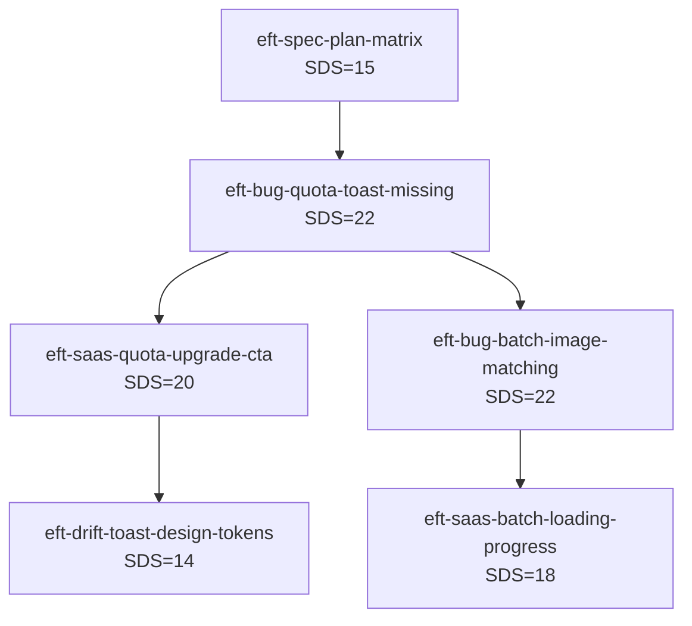

# SDS Refinement Gate — Phase 3.5 Story 拆分演算法

## 為什麼需要 Refinement Gate

Phase 3 結束後,Story 可能因為**跨模組合併**(CMRD) 累積過多 AC,進入 Pipeline 時 dev-story Sonnet 成功率劇降:

| AC 數量 | dev-story Sonnet 成功率 |
|:------:|:----------------------:|
| 1-5 | 95% |
| 6-10 | 85% |
| 11-15 | 70% |
| 16-20 | 50% |
| 21+ | 30% |

Phase 3.5 就是**強制節點**:計算每個 Story 的 SDS(Story Difficulty Score),過大者必須拆分。

---

## SDS 公式

```
SDS = AC_count × 1.5
    + affected_files × 2.0
    + cross_module_count × 5.0
    + br_rules_count × 1.0
    + plan_matrix_coverage × 0.5
    + estimated_pipeline_minutes / 10
    + skill_corrections_count × 1.5
```

### 參數定義

| 參數 | 說明 | 範例 |
|------|------|------|
| `AC_count` | Story 內 acceptance_criteria 數量 | 12 |
| `affected_files` | Story 影響的檔案數(unique) | 8 |
| `cross_module_count` | Story 涉及的 L2 模組數 | 3 |
| `br_rules_count` | Story 涉及的 BR-XXX 規則數 | 5 |
| `plan_matrix_coverage` | Story 影響的 Plan 數(0-5) | 3 |
| `estimated_pipeline_minutes` | dev-story 預估時間 | 90 |
| `skill_corrections_count` | Story 需校正的 Skill 章節數 | 2 |

### 範例計算

**Story: eft-saas-quota-toast-missing**
```
AC_count = 12
affected_files = 8 (useDataSourceValidation, ImagePanel, GeneratePdfButton, ...)
cross_module_count = 3 (DataSource, Image, Pdf)
br_rules_count = 5 (BR-DATA-02, BR-IMG-01, BR-BATCH-01, BR-PDF-02, BR-STORAGE-01)
plan_matrix_coverage = 5 (A1-A5 全 Plan)
estimated_pipeline_minutes = 90
skill_corrections_count = 3

SDS = 12×1.5 + 8×2.0 + 3×5.0 + 5×1.0 + 5×0.5 + 90/10 + 3×1.5
    = 18 + 16 + 15 + 5 + 2.5 + 9 + 4.5
    = 70

→ SDS > 50 **強制拆分**
```

---

## 拆分閾值

| SDS | 動作 |
|:---:|------|
| **< 20** | 直接 ready-for-dev,高成功率 |
| **20-35** | 直接 ready-for-dev,監控 Pipeline 結果 |
| **35-50** | **建議拆分**(主控端判斷) |
| **> 50** | **強制拆分**(不拆必 Pipeline 失敗) |

---

## 4 種拆分策略

Sub-agent 必須評估所有 4 種策略,選擇 SDS 降幅最大者。

### 策略 1: 根因類別拆(Root Cause Partitioning)

依 5 大類 16 子類分組。適用於混入多種根因類別的 Story。

```
原 Story: eft-saas-quota-toast-missing (SDS=70, 12 AC)
  └─ AC-1~5: Bug (code 沒呼叫 toast 函式) — A1 類
  └─ AC-6~9: SaaS Compliance (toast 有但缺 CTA) — B2 類
  └─ AC-10~12: Design Drift (toast 樣式不符 design-system) — C1 類

拆分後:
  ├─ eft-bug-quota-toast-missing-call (5 AC, SDS=22)
  ├─ eft-saas-quota-upgrade-cta (4 AC, SDS=20)
  └─ eft-drift-toast-design-tokens (3 AC, SDS=14)

平均 SDS 降幅: 70 → 18.7 (74% 降幅)
```

**依賴鏈**: bug → saas → drift (spec 先行若有)

### 策略 2: 影響檔案集合拆(File Cluster Partitioning)

使用圖論 connected components 演算法。把 AC 影響的檔案建成圖,有 ≥1 個共同檔案的 AC 連線。

```
原 Story: eft-editor-validation-system (SDS=68, 14 AC, 14 檔案)

圖論分析:
  Component 1 (前端驗證): 
    檔案: [useDataSourceValidation.ts, DataSourcePanel.tsx, ImagePanel.tsx, BatchImagePanel.tsx, useExcelWorker.ts]
    AC: [AC-1, AC-3, AC-5, AC-7, AC-9]
  
  Component 2 (後端驗證): 
    檔案: [ProjectsController.cs, ValidationService.cs, QuotaService.cs]
    AC: [AC-2, AC-4, AC-6, AC-8]
  
  Component 3 (共享類型): 
    檔案: [src/types/*.ts]
    AC: [AC-10, AC-11]

拆分後:
  ├─ eft-validation-frontend (5 AC, SDS=28)
  ├─ eft-validation-backend (4 AC, SDS=24)
  └─ eft-validation-shared-types (2 AC, SDS=12)
```

**依賴鏈**: shared-types → backend → frontend

### 策略 3: Plan 矩陣拆(Plan Matrix Partitioning)

適用於跨多 Plan 但實作差異大的 Story。

```
原 Story: eft-pdf-generation-limits (SDS=58, 12 AC)
  └─ AC-1~5: Free 方案 PDF 限制(2 頁 + 浮水印)
  └─ AC-6~9: 付費方案 PDF 限制(依 plan quota)
  └─ AC-10~12: Business 客製 PDF 限制

拆分後:
  ├─ eft-pdf-free-watermark (5 AC, SDS=22)
  ├─ eft-pdf-paid-quota (4 AC, SDS=18)
  └─ eft-pdf-business-custom (3 AC, SDS=15)
```

**依賴鏈**: 無(可平行)

### 策略 4: BR 規則拆(Business Rule Partitioning)

依 BR-XXX 規則分組。最乾淨但也可能最片段。

```
原 Story: eft-image-handling (SDS=64, 12 AC)
  └─ AC-1~4: BR-IMG-01 (單張上傳)
  └─ AC-5~8: BR-IMG-02 (圖片降採樣)
  └─ AC-9~12: BR-BATCH-01 (批次匹配)

拆分後:
  ├─ eft-bug-image-single-upload (4 AC, SDS=20)
  ├─ eft-bug-image-downsampling (4 AC, SDS=18)
  └─ eft-bug-batch-image-matching (4 AC, SDS=22)
```

**依賴鏈**: 依 BR 語意判斷

---

## 策略選擇演算法

```python
def choose_strategy(story):
    """選擇 SDS 降幅最大的拆分策略"""
    candidates = []
    
    for strategy_name, strategy_func in [
        ('root_cause', split_by_root_cause),
        ('file_cluster', split_by_file_cluster),
        ('plan_matrix', split_by_plan_matrix),
        ('br_rules', split_by_br_rules)
    ]:
        sub_stories = strategy_func(story)
        if len(sub_stories) < 2:
            continue  # 策略不適用(無法拆分)
        
        # 計算降幅與平衡度
        sds_list = [s.sds for s in sub_stories]
        max_sds_after = max(sds_list)
        sds_drop = story.sds - max_sds_after
        balance_penalty = std_deviation(sds_list) * 0.3
        
        # 綜合分數(降幅高且平衡好)
        score = sds_drop - balance_penalty
        
        candidates.append({
            'strategy': strategy_name,
            'score': score,
            'sub_stories': sub_stories,
            'max_sds_after': max_sds_after
        })
    
    # 選最高分
    return max(candidates, key=lambda x: x['score'])
```

---

## 拆分後的依賴圖重建

拆分產生的子 Stories 必須重建依賴鏈,確保 Pipeline 按正確順序執行:

### 優先順序規則

```
Priority 1 (最先): Spec 類(D 類) — 商業規則必須先釐清
Priority 2: Bug 類(A 類) — 讓功能能跑
Priority 3: SaaS Compliance 類(B 類) — 加 CTA、friendly messages
Priority 4 (最後): Design Drift 類(C 類) — 視覺打磨
```

### 範例依賴圖



### Pipeline Wave 規劃

```
Wave 1 (P0 Spec): [eft-spec-plan-matrix]
Wave 2 (P1 Bug): [eft-bug-quota-toast-missing, eft-bug-batch-image-matching] (並行 2)
Wave 3 (P2 SaaS): [eft-saas-quota-upgrade-cta, eft-saas-batch-loading-progress] (並行 2)
Wave 4 (P3 Drift): [eft-drift-toast-design-tokens] (串行)
```

---

## Phase 3.5 Refinement Report 範本

```markdown
# Epic-EFT Refinement Report
> 產出時間: {timestamp}
> Phase 3 結束 Story 數: {N}
> Phase 3.5 拆分後 Story 數: {M}
> SDS 平均降幅: {x}%

## 拆分決策表

| 原 Story | 原 SDS | 策略 | 拆分數 | 子 SDS 範圍 | 降幅 |
|---------|:-----:|------|:-----:|:-----------:|:---:|
| eft-saas-quota-toast | 70 | root_cause | 3 | 14-22 | 74% |
| eft-editor-validation | 68 | file_cluster | 3 | 12-28 | 59% |
| eft-pdf-generation-limits | 58 | plan_matrix | 3 | 15-22 | 62% |

## 依賴圖

[Mermaid graph here]

## Pipeline Batch Plan

### Wave 1 (P0 Spec, 無前置)
- eft-spec-plan-matrix (SDS=15)

### Wave 2 (P1 Bug, depends on Wave 1)
- eft-bug-quota-toast-missing (SDS=22)
- eft-bug-batch-image-matching (SDS=22)
- eft-validation-shared-types (SDS=12)

### Wave 3 (P2 SaaS, depends on Wave 2)
- eft-saas-quota-upgrade-cta (SDS=20)
- eft-saas-batch-loading-progress (SDS=18)

### Wave 4 (P3 Drift, depends on Wave 3)
- eft-drift-toast-design-tokens (SDS=14)

## 統計摘要

- Phase 3 結束: 8 Stories,平均 SDS 52
- Phase 3.5 拆分: 4 Stories 觸發拆分,產生 12 子 Stories
- Phase 3.5 結束: 16 Stories,平均 SDS 18
- Pipeline 預估總時間: 4 Waves × 平均 45 分 = 3 小時
- 預估成功率: 92%(基於 SDS < 25 的 Story 佔比 95%)
```

---

## FORBIDDEN

- ❌ 跳過 Phase 3.5 直接進 Pipeline(SDS > 50 必失敗)
- ❌ 只用一種拆分策略不評估其他(可能錯過更好選項)
- ❌ 拆分後不重建依賴鏈(Pipeline 執行順序錯亂)
- ❌ 拆分時不更新原 Story 狀態(變成孤兒 Story)
- ❌ 子 Story 數量 > 5(過度拆分造成管理負擔)
- ❌ 拆分後子 Story 平均 SDS 仍 > 30(沒有真正降風險)
