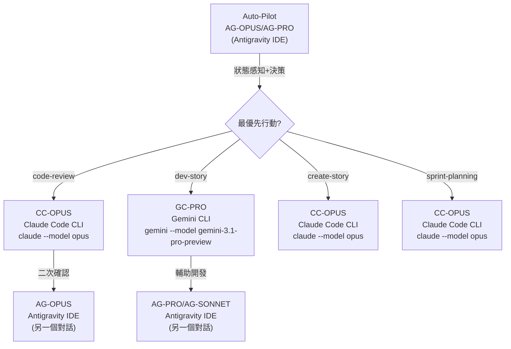

# Auto-Pilot 工作流程多 Agent 協作研究分析

> **分析者**: AG-OPUS (Antigravity IDE - Claude Opus 4.6 Thinking)
> **日期**: 2026-02-27
> **範疇**: [bmad-workflow-bmm-auto-pilot.md](file:///c:/Users/Alan/Desktop/Projects/MyProject-MVP%28Antigravity%29/.agent/workflows/bmad-workflow-bmm-auto-pilot.md) 改進方案

---

## 議題總覽

| # | 議題 | 核心問題 | 嚴重度 |
|---|------|---------|--------|
| 1 | Workflow 需開新 PowerShell 視窗 | auto-pilot 的四種 workflow 需在獨立終端機執行 | 🟠 架構性 |
| 2 | 多 Agent 協作的模型調用策略 | 需依據 [multi-engine-sop.md](file:///c:/Users/Alan/Desktop/Projects/MyProject-MVP%28Antigravity%29/docs/reference/multi-engine-sop.md) 的分工矩陣調用適合的引擎/模型 | 🟠 策略性 |
| 3 | PowerShell 長時間執行導致 Agent 中斷 | Antigravity IDE 內建 Agent 等待 Gemini CLI 執行過久而逾時停止 | 🔴 致命性 |

---

## 議題 1：Workflow 需開新 PowerShell 執行

### 現況分析

目前 [bmad-workflow-bmm-auto-pilot.md](file:///c:/Users/Alan/Desktop/Projects/MyProject-MVP%28Antigravity%29/.agent/workflows/bmad-workflow-bmm-auto-pilot.md) 的「§3 執行」階段設計為：

```
向使用者報告你的分析結果...然後直接執行該指令
```

問題在於「直接執行」意味著 **在同一個對話視窗內** 觸發 `/code-review`、`/dev`、`/create` 等 workflow，但這些 workflow 的實際設計是：

- 需載入 [_bmad/core/tasks/workflow.xml](file:///c:/Users/Alan/Desktop/Projects/MyProject-MVP%28Antigravity%29/_bmad/core/tasks/workflow.xml)（BMAD 核心執行引擎）
- 需讀取對應的 `workflow.yaml`（每個 workflow 各自的配置）
- 涉及大量檔案讀寫、程式碼生成、文件更新

### 核心矛盾

按照 [multi-engine-sop.md](file:///c:/Users/Alan/Desktop/Projects/MyProject-MVP%28Antigravity%29/docs/reference/multi-engine-sop.md) §2 的標準四階段流程：

| Workflow | 主責引擎 | Antigravity 的角色 |
|----------|---------|-------------------|
| `code-review` | **Claude Code CLI** (CC-OPUS) | ❌ 非主責，最多做二次確認 |
| `dev-story` | **Gemini CLI** (GC-PRO) | 🛡️ 輔助開發 |
| `create-story` | **Claude Code CLI** (CC-OPUS) | ❌ 非主責 |
| `sprint-planning` | **Claude Code CLI** (CC-OPUS) | ❌ 非主責 |

> [!IMPORTANT]
> auto-pilot 從 Antigravity IDE 內部直接執行這些 workflow 是**違反分工原則**的。
> Antigravity 應該只做**狀態感知 + 決策建議**，然後**委派到正確的引擎**去執行。

### 建議方案

**Antigravity auto-pilot 改為「指揮台」模式**：

1. **感知**：讀取 `sprint-status.yaml` + `tracking/active/` + `project-context.md`
2. **決策**：分析最優先行動
3. **委派**：根據分工矩陣，開啟對應引擎的 PowerShell 視窗

#### 委派策略表

| 決策結果 | 應委派至 | PowerShell 指令 | 說明 |
|---------|---------|----------------|------|
| 🔴 code-review | Claude Code CLI | `claude --model opus` | CC-OPUS 主導對抗式審查 |
| 🟢 dev-story | Gemini CLI | `gemini --model gemini-3.1-pro-preview` | GC-PRO 利用 1M token 視窗 |
| 🔵 create-story | Claude Code CLI | `claude --model opus` | CC-OPUS 主導需求分析 |
| 🟡 sprint-planning | Claude Code CLI | `claude --model opus` | CC-OPUS 主導 SM 角色 |

---

## 議題 2：多 Agent 協作的模型調用策略

### 現有分工矩陣（來源：[multi-engine-sop.md](file:///c:/Users/Alan/Desktop/Projects/MyProject-MVP%28Antigravity%29/docs/reference/multi-engine-sop.md) §2）



### 模型選擇依據

| 任務特性 | 推薦模型 | 原因 |
|---------|---------|------|
| 需要深度推理（架構設計、code-review） | Claude Opus 4.6 (CC-OPUS) | 最強推理能力 |
| 大量程式碼讀寫（dev-story） | Gemini 3.1 Pro (GC-PRO) | 1M token 免費視窗 |
| 需要推理的輔助開發 | Claude Sonnet 4.6 (AG-SONNET) | 速度/推理最佳平衡 |
| 快速小任務 | Gemini Flash (AG-FLASH) | 低延遲 |
| auto-pilot 狀態分析 | Claude Opus 4.6 Thinking (AG-OPUS) 或 Gemini 3.1 Pro High (AG-PRO) | 需要分析判斷 |

### Antigravity 內部的 auto-pilot 應選用什麼模型？

auto-pilot 的本質是「讀取狀態 → 推理決策」，**不涉及大量程式碼撰寫**，因此：

- **推薦**: `Claude Opus 4.6 (Thinking)` (AG-OPUS) — 分析能力最強
- **備選**: `Gemini 3.1 Pro (High)` (AG-PRO) — 免費且上下文大

---

## 議題 3：PowerShell 長時間執行導致 Agent 中斷（🔴 致命性問題）

### 問題根因分析

```
Antigravity Agent (AG-OPUS)
  ┃
  ┃  run_command("gemini --model gemini-3.1-pro-preview")
  ┃       ↓
  ┃  [等待 Gemini CLI 完成 dev-story]
  ┃  [Gemini CLI 執行 10~30 分鐘...]
  ┃       ↓
  ┃  ❌ Antigravity LLM 對話逾時！
  ┃  ❌ Agent 停止運作！
  ┃  ❌ 任務中斷，Gemini CLI 的結果無法被接收！
  ┗━━━━━━━━━━━━━━━━━━━━━━━━━━━━━━━━━━
```

### 核心限制

| 限制 | 說明 |
|------|------|
| Antigravity Agent LLM 對話有**隱式逾時** | Agent 等待 `run_command` 回應時間過長會被系統判定為閒置而中斷 |
| `run_command` 的 `WaitMsBeforeAsync` 最大值為 **10,000ms** | 只能等待 10 秒就必須轉為背景執行 |
| `command_status` 的 `WaitDurationSeconds` 最大值為 **300** | 每次最多等待 5 分鐘，但實際 LLM 對話可能在此之前就逾時 |

### 解決方案

#### 方案 A：「Fire-and-Forget」委派模式（✅ 推薦）

**核心思路**：auto-pilot **不等待**被委派任務完成。它的職責是「決策 + 啟動」，而非「監控 + 等待」。

```
Auto-Pilot 執行流程：
  1. 感知 → 讀取狀態檔案
  2. 決策 → 推理最優先行動
  3. 委派 → 開新 PowerShell 視窗，啟動對應引擎
  4. 報告 → 通知使用者已委派
  5. 結束 → 不等待結果，交由使用者監控
```

**實作方式**：

```powershell
# 在 Antigravity 的 run_command 中使用 Start-Process 開新視窗
Start-Process powershell -ArgumentList "-NoExit", "-Command", "cd 'C:\Users\Alan\Desktop\Projects\MyProject-MVP'; gemini --model gemini-3.1-pro-preview"
```

- `Start-Process` 會**立即返回**，不會阻塞 Antigravity Agent
- `-NoExit` 確保 PowerShell 視窗在任務完成後保持開啟，使用者可查看結果
- Antigravity Agent 可以繼續工作或正常結束對話

#### 方案 B：Polling 輪詢模式（⚠️ 有風險）

```
Auto-Pilot 執行流程：
  1. 感知 → 讀取狀態檔案
  2. 決策 → 推理最優先行動
  3. 委派 → 啟動背景指令 (WaitMsBeforeAsync=500)
  4. 使用 command_status 定期輪詢（每 60 秒一次，WaitDurationSeconds=60）
  5. 問題：LLM 對話仍可能在多次輪詢後逾時
```

> [!CAUTION]
> 方案 B 有明顯缺陷：即使使用輪詢，如果任務超過 LLM 對話的隱式逾時限制（推估 15-30 分鐘），Agent 仍然會中斷。

#### 方案 C：檔案信號機制（🔬 進階方案）

如果需要 auto-pilot 自動偵測任務完成並繼續下一步：

1. 被委派的引擎（Claude Code / Gemini CLI）在完成時寫入信號檔案：
   ```
   docs/tracking/signals/{story-id}.done
   ```
2. 使用者在 Antigravity IDE 中再次呼叫 auto-pilot
3. auto-pilot 讀取 `sprint-status.yaml`（已被被委派引擎更新）
4. 自動進入下一階段

> 這其實就是**目前的交接協議**——每次呼叫 auto-pilot 時，它都會重新感知狀態，自然能偵測到上一階段的完成。

---

## 綜合建議：改進後的 Auto-Pilot Workflow

### 改進版 [bmad-workflow-bmm-auto-pilot.md](file:///c:/Users/Alan/Desktop/Projects/MyProject-MVP%28Antigravity%29/.agent/workflows/bmad-workflow-bmm-auto-pilot.md)

```markdown
## 1. 狀態感知（不變）
讀取 sprint-status.yaml、project-context.md、tracking/active/

## 2. 智慧決策（不變）
分析最優先行動（救援→阻礙排除→推進開發→規劃補充→週期管理）

## 3. 委派執行（✨ 新設計）
根據決策結果，使用 Start-Process 開啟對應引擎的獨立 PowerShell 視窗。
AUTO-PILOT 本身不執行任務，只負責決策與委派。

## 4. 使用者通知
報告：「最優先行動是 [X]，已在新 PowerShell 視窗中啟動 [引擎]。
請在任務完成後再次呼叫 /bmad-workflow-bmm-auto-pilot 進入下一階段。」
```

### 關鍵設計原則

| 原則 | 說明 |
|------|------|
| **不阻塞** | auto-pilot 永遠不等待 CLI 完成 |
| **不跨界** | 不在 Antigravity 內直接執行 CC-OPUS / GC-PRO 的任務 |
| **冪等性** | 每次呼叫都重新感知狀態，安全重複執行 |
| **人在回路** | 使用者決定何時推進，AI 只建議 |

---

## 下一步行動建議

1. **更新** [bmad-workflow-bmm-auto-pilot.md](file:///c:/Users/Alan/Desktop/Projects/MyProject-MVP%28Antigravity%29/.agent/workflows/bmad-workflow-bmm-auto-pilot.md)，將「直接執行」改為「委派至正確引擎」
2. **新增** 各引擎的啟動指令模板到 auto-pilot workflow 中
3. **考慮** 是否需要建立 TRS Story 來正式追蹤此改動

> [!NOTE]
> 此分析基於目前 Antigravity IDE 的架構限制。如果未來 Antigravity 支援「無限對話」或「背景任務管理」，方案 B/C 可重新考慮。
